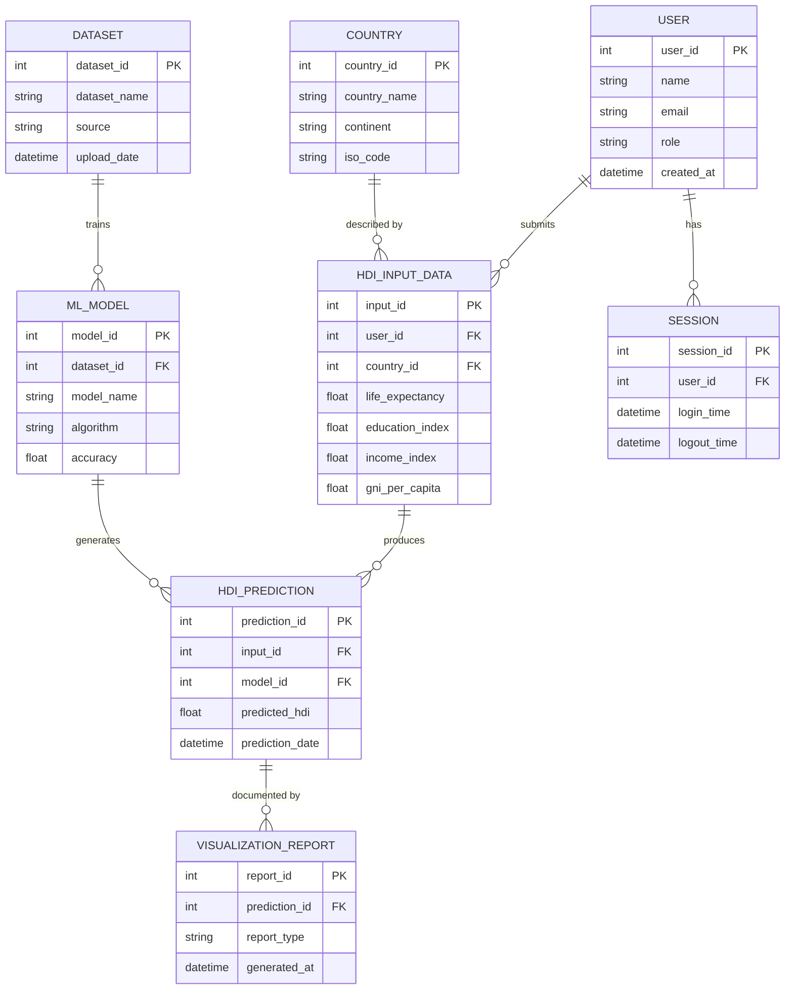

# ER Diagram — HDI Prediction System

This document describes the database design for the optional persistence layer
of the HDI Prediction System (SQLite/MySQL). The Flask app in this project
runs fully without a database, but this schema is provided so the project can
be extended into a multi-user, history-tracking system for a final-year
submission or viva demonstration.

## Entity-Relationship Diagram (Mermaid)



> Paste the Mermaid block above into [mermaid.live](https://mermaid.live) or any
> Mermaid-compatible Markdown viewer (GitHub, VS Code with the Mermaid
> extension, Notion, etc.) to render the visual diagram.

## Entity Descriptions & Relationships

| Entity | Purpose |
|---|---|
| **USER** | Represents anyone using the system (student, researcher, admin). Stores login/role info. |
| **SESSION** | Tracks each login/logout event for a user — one USER can have many SESSIONs (1:N). |
| **COUNTRY** | Master list of countries with continent and ISO code, reused across many predictions. |
| **DATASET** | Metadata about the raw dataset(s) used to train models (e.g. Kaggle HDI dataset, upload date). |
| **ML_MODEL** | Each trained model (Linear Regression, Random Forest, Decision Tree) is stored with its algorithm name and accuracy (R² score). One DATASET can produce many ML_MODEL records (1:N), since you can retrain multiple algorithms on the same data. |
| **HDI_INPUT_DATA** | The four indicator values a user submits through the web form, linked to the USER who submitted them and the COUNTRY they represent. |
| **HDI_PREDICTION** | The output of running an ML_MODEL against a specific HDI_INPUT_DATA row — stores the predicted HDI value and timestamp. |
| **VISUALIZATION_REPORT** | Optional generated report/plot tied to a specific prediction (e.g. a gauge chart or comparison chart), for future dashboard features. |

### Cardinalities

- USER (1) → (N) SESSION
- USER (1) → (N) HDI_INPUT_DATA
- COUNTRY (1) → (N) HDI_INPUT_DATA
- DATASET (1) → (N) ML_MODEL
- HDI_INPUT_DATA (1) → (N) HDI_PREDICTION
- ML_MODEL (1) → (N) HDI_PREDICTION
- HDI_PREDICTION (1) → (N) VISUALIZATION_REPORT

### Suggested SQLite Table Creation Script

```sql
CREATE TABLE USER (
    user_id INTEGER PRIMARY KEY AUTOINCREMENT,
    name TEXT NOT NULL,
    email TEXT UNIQUE NOT NULL,
    role TEXT DEFAULT 'student',
    created_at DATETIME DEFAULT CURRENT_TIMESTAMP
);

CREATE TABLE COUNTRY (
    country_id INTEGER PRIMARY KEY AUTOINCREMENT,
    country_name TEXT NOT NULL,
    continent TEXT,
    iso_code TEXT
);

CREATE TABLE DATASET (
    dataset_id INTEGER PRIMARY KEY AUTOINCREMENT,
    dataset_name TEXT NOT NULL,
    source TEXT,
    upload_date DATETIME DEFAULT CURRENT_TIMESTAMP
);

CREATE TABLE ML_MODEL (
    model_id INTEGER PRIMARY KEY AUTOINCREMENT,
    dataset_id INTEGER REFERENCES DATASET(dataset_id),
    model_name TEXT NOT NULL,
    algorithm TEXT NOT NULL,
    accuracy REAL
);

CREATE TABLE HDI_INPUT_DATA (
    input_id INTEGER PRIMARY KEY AUTOINCREMENT,
    user_id INTEGER REFERENCES USER(user_id),
    country_id INTEGER REFERENCES COUNTRY(country_id),
    life_expectancy REAL,
    education_index REAL,
    income_index REAL,
    gni_per_capita REAL
);

CREATE TABLE HDI_PREDICTION (
    prediction_id INTEGER PRIMARY KEY AUTOINCREMENT,
    input_id INTEGER REFERENCES HDI_INPUT_DATA(input_id),
    model_id INTEGER REFERENCES ML_MODEL(model_id),
    predicted_hdi REAL,
    prediction_date DATETIME DEFAULT CURRENT_TIMESTAMP
);

CREATE TABLE VISUALIZATION_REPORT (
    report_id INTEGER PRIMARY KEY AUTOINCREMENT,
    prediction_id INTEGER REFERENCES HDI_PREDICTION(prediction_id),
    report_type TEXT,
    generated_at DATETIME DEFAULT CURRENT_TIMESTAMP
);

CREATE TABLE SESSION (
    session_id INTEGER PRIMARY KEY AUTOINCREMENT,
    user_id INTEGER REFERENCES USER(user_id),
    login_time DATETIME,
    logout_time DATETIME
);
```
