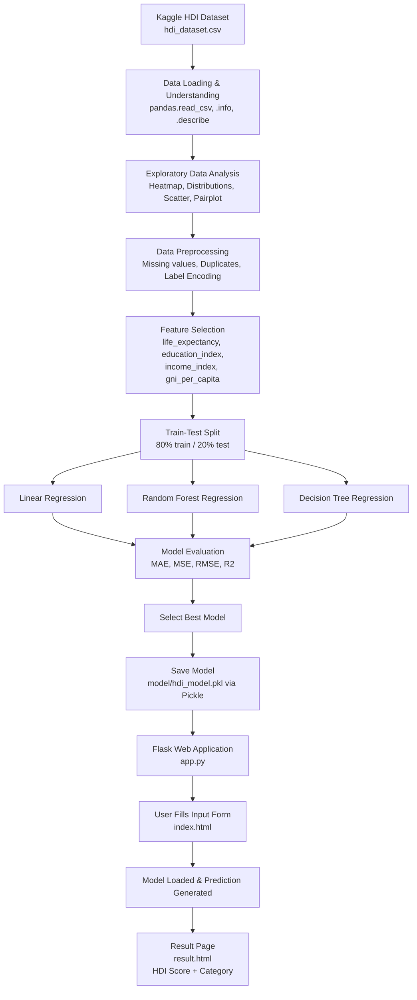
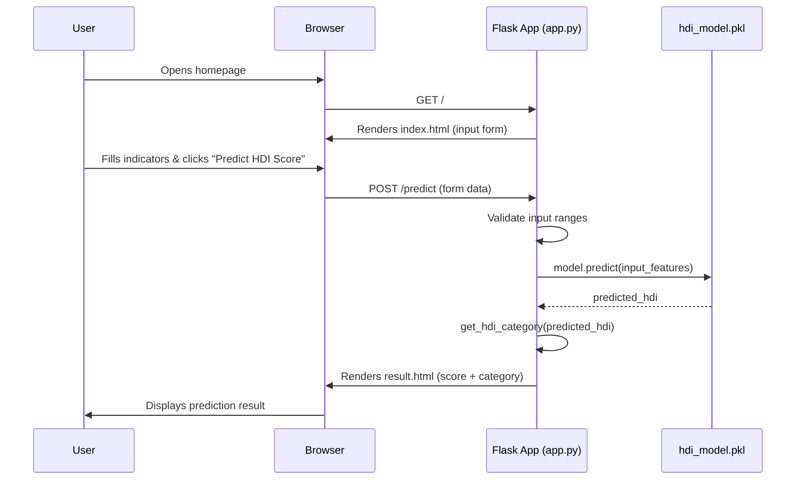

# Project Workflow Diagram — HDI Prediction System

## End-to-End Pipeline

## Request Flow Inside the Flask App

> Render these diagrams by pasting the Mermaid code into
> [mermaid.live](https://mermaid.live) or viewing this file in VS Code with
> the "Markdown Preview Mermaid Support" extension.
